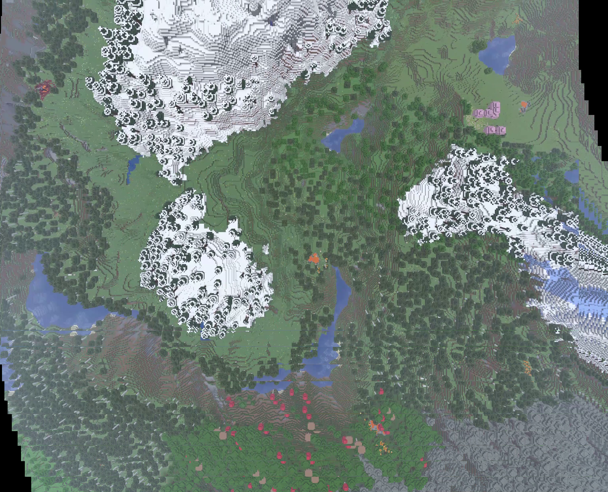
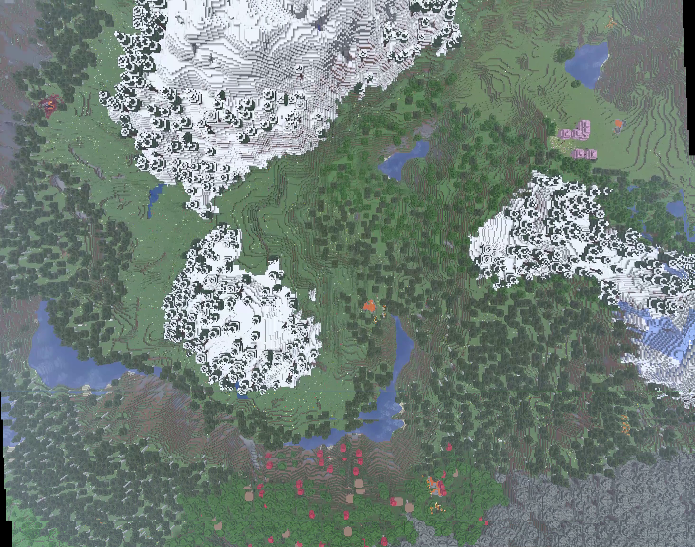
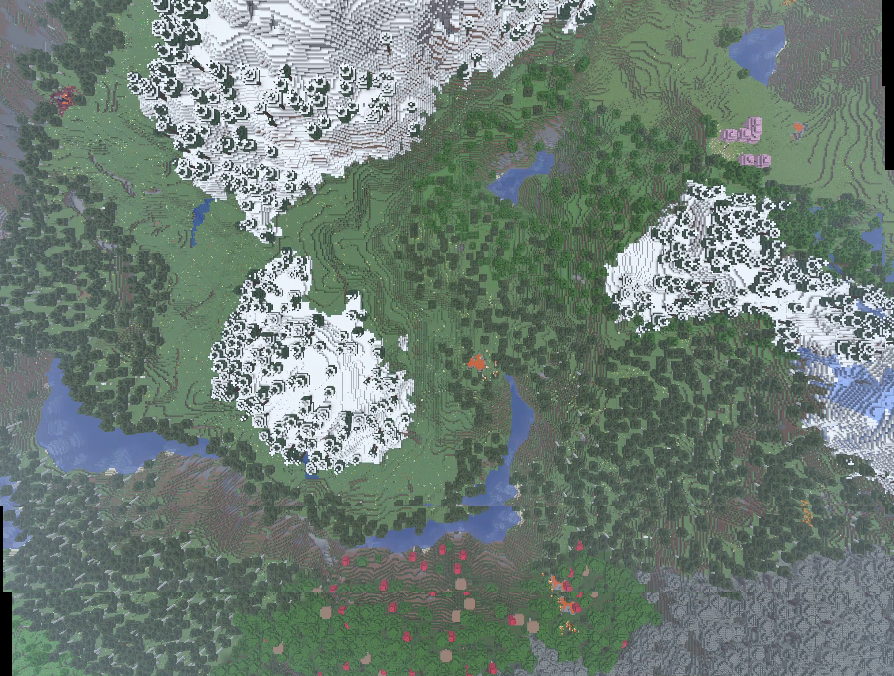
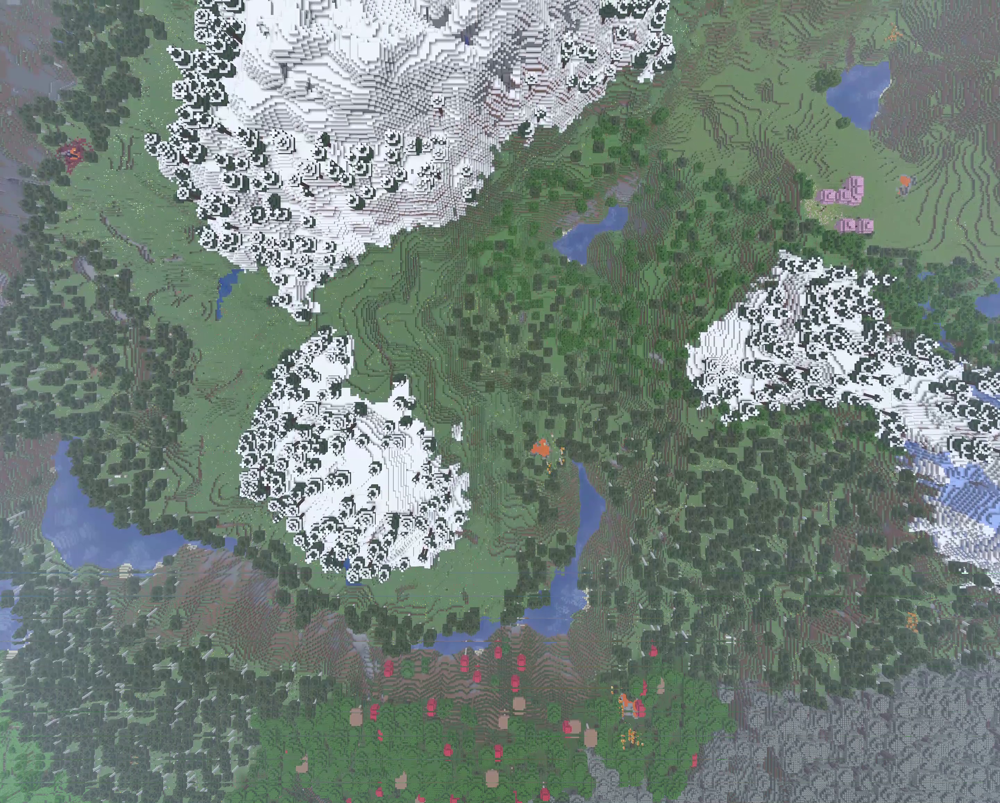

# Image Stitcher

For this image stitcher, I wanted to challenge myself and hand roll most of the code to align and stitch images. In CS180, we recently build an image aligner from first principles using NCC and I thought I'd implement some of that code to apply here. 

Given that the video we are stitching together is pretty much exclusively linear motion, cartesian alignment is enough.

Visit [my CS180 project 1 website](https://tim-nguyen0.github.io/cs180/1/p1.html) to see the implementation for all of the alignment apparatus, the source code which is used in this task is also obviously available in this repository.

Essentially, to align 2 images, I normalize both (grayscaled) images by removing their bias and dividing by $\sqrt{variance}$ with respect to intensities, correlate them componentwise, and maximize the average correlations per pixel. 

There are some other steps taken to ensure better edge detections for lots of (band passes), as well as image pyramiding for performance (although pyramidding also notably reduces the quality of results for noisy areas).

For this project, I sample images at some constant sampling rate and align and overlay samples sequentially after calculating offsets. 

Below are stitches done with image pyramids with the coarsest layer no more than 1000 pixels in the largest dimension.

<table width="100%">
  <tr>
    <td align="center" width="33%">
        <figure>
            
            <figcaption><em>Figure 1: Multiscale pyramid alignment at 1 Hz.</em></figcaption>
        </figure>
    </td>
    <td align="center" width="33%">
      <figure>
        
        <figcaption><em>Figure 2: Multiscale pyramid alignment at 0.5 Hz.</em></figcaption>
      </figure>
    </td>
    <td align="center" width="33%">
        <figure>
            
            <figcaption><em>Figure 23: Multiscale pyramid alignment at 0.25 Hz.</em></figcaption>
        </figure>
    </td>
  </tr>
</table>

You might notice some shearing here on higher sampling rates, and this is likely due the downsampled mountains (along with the stutter in the video) creating areas that are difficult to differentiate from eachother once downsampled. However, the 0.25 scale one is much better.

Notably, however, we see that the lower sampling rates cause some cropping towards the end due to the final frames being omitted form stitching. A way to improve this might be to hardcode the final frame to be stitched on, however I've been working on this for beyond the alotted time I've made and will not be doing that, though it should be simple.

Each frame alignment in this batch took about 2 seconds. For this 10 second clip that means that the 1 Hz alignment took ~20 seconds, and the 0.25 Hz sampling rate run took ~5 seconds.

Below I did a 2 runs with less pyramiding (all at 1 hz), and we see much better performance with regards to shearing. Notably, less pyramiding (higher resolution coarse layer) shows decent improvement with very little performance hits, while the no pyramidding layer took notably longer at just over 2 minutes per frame! That's almost a 60x time increase for results that (I would argue) are not 60x better. You can judge for yourself. 

<table width="100%">
  <tr>
    <td align="center" width="33%">
        <figure>
            
            <figcaption><em>Figure 1: Multiscale pyramid alignment at 1 Hz.</em></figcaption>
        </figure>
    </td>
    <td align="center" width="33%">
      <figure>
        
        <figcaption><em>Figure 4: Finer multiscale pyramid alignment at 0.5 Hz.</em></figcaption>
      </figure>
    </td>
    <td align="center" width="33%">
        <figure>
            
            <figcaption><em>Figure 5: No pyramid alignment at 1 Hz.</em></figcaption>
        </figure>
    </td>
  </tr>
</table>

Notably, this shows that for best results on a dynamically moving vehicle (using NCC), velocity should be factored into how often we sample. Lower sampling rate works since the speed is quite low and so the information needed for alignment is present even between wider frame gaps.

This stitcher also only works due to the linear motion that doesn't have any major changes in camera angle, as it uses NCC. To make this more resilient, the obvious thing to do would be to use an ORB transform or something that is invariant in $SE(2)$. I wanted to keep this almost completely hand-rolled however, and this is the progress that was made. 

Replacing the NCC with a transform should be fairly easy as there is a single call to the offset calculation function. However for this to work for rotations we'd need to pass a third rotational parameter for the offsets to ensure accurate stitching which would require a change to the actual composition function, but nonetheless, that should be somewhat stragihtforward. 

To close, my general sentiment towards optimizing for this specific use case would be to force the final frame to be one of the frames used to normalized, do precursor pass for velocity (if velocity is not a paramterer which can be accessed directly), and apply an even coarser pyramid for realtime speeds.

****
AI Disclosure: no written code in this sub-task directory was directly generated by an LLM.